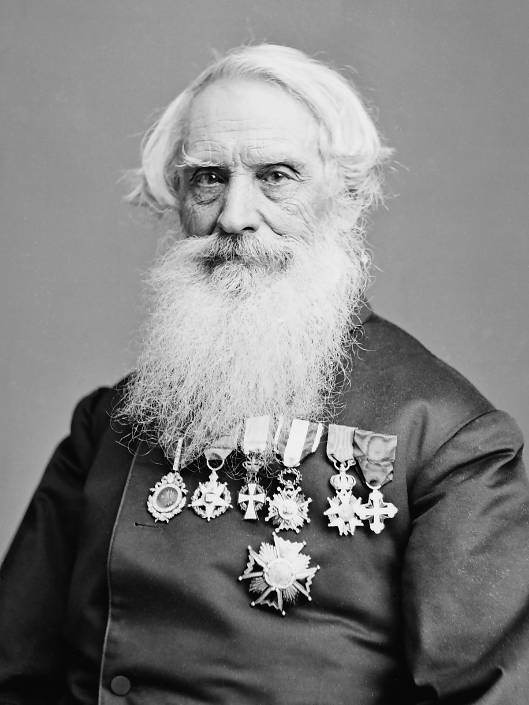

# Morse

<p align="center">
  <picture>
    <source media="(prefers-color-scheme: dark)" srcset="./.assets/telegraph-white.svg">
    
  </picture>
</p>

A chat app using [Vite](https://vitejs.dev), [Vue.js](https://vuejs.org), [Tailwind CSS](https://tailwindcss.com/) in <abbr title="The front is an abstraction, simplifying the underlying component by providing a user-friendly interface">front-end</abbr> and [Hono](https://hono.dev) and [Drizzle ORM](https://orm.drizzle.team) on <abbr title="Handles data storage and business logic">back-end</abbr>, both created with [Bun](https://bun.sh).

## 🛠️ Installation

To install dependencies:

```bash
bun install
```

To run:

```bash
bun run index.ts
```

## 🕐 ChangeLog

- `2024/05/29` - project created with [Bun v1.1.10](./package.json)
  - Added [Vite v5.2.0](./apps/site) & [Vue.js v3.4.21](./apps/site)  

## Credits

<p align="center">
  <br />
  <em>Samuel Morse(★ 27/4/1791 - Charlestown · 🕆 2/4/1872 - Nova Iorque)</em>
</p>

- Vite
- Vue.js
- TypeScript
- Bun
- Tailwind CSS

This project was created using `bun init` in bun v1.1.10. [Bun](https://bun.sh) is a fast all-in-one JavaScript runtime.
